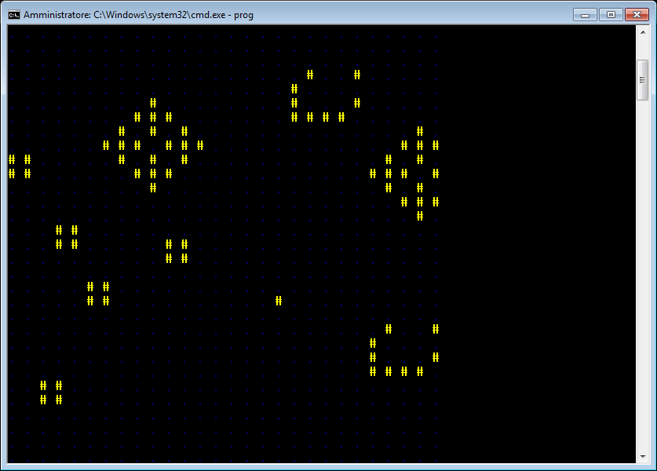

## Game of Life implenentation in C++ Console

This is a simple representation of the "Game of Life" cellular automa, written in C++ using the console. It is cross-platform.

A simple test:

   

To compile this project, open a terminal (or command prompt) in the project's directory, and run:
    
```
g++ main.cpp -o game_of_life
``` 
This will create the executable **game_of_life** (or **game_of_life.exe** in Windows) inside the project's directory.